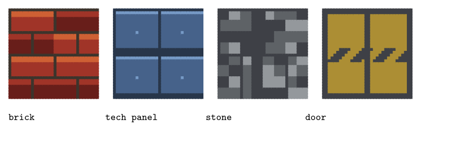

# Implementation notes

Details of how the engine works, and the TeX-specific problems it had to solve.
For what DoomTex is and how to play it, see [README.md](README.md).

## Fixed point

TeX has no floating point fast enough to run 320 times a frame, so all
arithmetic is integers scaled by 1024. `1.0` is `1024`. Angles use 1024 units
for a full turn, so 256 is a right angle.

Two things about `\numexpr` shape most of `engine/fixed.tex`.

**Division rounds, it does not truncate.** `\numexpr 5/2` is `3`. Converting a
world coordinate to a grid index with a bare `/` therefore reads the wrong cell
about half the time, and a texture column computed as `1023/32` comes out as
`32`, one past the end of a 32-wide texture. Both bugs are silent. All floor
division goes through `\dtexFloorDiv`, which compensates:

```tex
\cs_new:Npn \dtexFloorDiv #1#2
  { \the \numexpr (2*(#1)+(#2))/(2*(#2))-1 \relax }
```

That form is only valid for a positive numerator, so `\dtexFloor` shifts by a
multiple of 1024 first and subtracts it back, which keeps negative coordinates
correct.

**Products overflow at 2^31**, and TeX raises `! Arithmetic overflow` rather
than wrapping, so mistakes are at least loud. There are two multiplies:
`\dtexMul` computes `(a*b)/1024` directly and is used in the raycaster's inner
loop where both operands are small, and `\dtexMulS` splits an operand so it
stays in range for everything else.

Sine and cosine come from a 257-entry first-quadrant table, with the other three
quadrants derived by symmetry. The camera needs them twice a frame, not per
column, so lookup cost is irrelevant.

## The renderer draws no coordinates

Each screen column is a `\vbox` with `\offinterlineskip` containing a stack of
coloured rules: ceiling gradient, wall texture segments, floor gradient. Boxes
stacked that way abut exactly, so the vertical layout comes from TeX's box model
and there is no per-pixel positioning arithmetic anywhere in the renderer.

Every band height is an integer number of pixels, and each column is computed as
differences from a running cursor, so ceiling + wall + floor always sums to
exactly 200. Fractional heights produce visible seams; integers do not. At 288
dpi the result is pixel-exact: zero blend pixels between bands, and a single
colour change across 200 abutting columns.

Sprites are a second pass drawn on top, positioned with `\rlap` and `\raisebox`.
Each sprite column is tested against the wall distance recorded for that screen
column, so actors are hidden behind geometry. They are drawn far-to-near, and a
dead imp stays on the floor as a corpse while a collected pickup does not.

## Exactly abutting rectangles are not enough

Pixel-exact geometry still left a fault that only some viewers show. Poppler has
two rasterisers. `pdftoppm` and Okular use Splash; evince, xreader and most GTK
viewers use Cairo.

Cairo antialiases every rectangle independently. Where two fills share an edge
they each cover about half of the boundary device pixel, and source-over
compositing leaves `(1-a1)(1-a2)` of the page showing through. That is about a
quarter of the background, and with roughly ten thousand rectangles per frame it
becomes a grid of faint hairlines over the whole viewport, at every zoom level.
Splash renders the same file cleanly, which is how it went unnoticed for a while.

The fix is to let each band bleed into its neighbour below and to the right, and
take the bleed back with a negative kern so nothing moves:

```tex
\hbox { \vrule width \dim_eval:n { \c_dtex_px_dim + \c_dtex_overlap_dim }
               height <h> depth \c_dtex_overlap_dim }
\kern -\c_dtex_overlap_dim
```

The overflow is always painted over by the following band, so the visible image
is unchanged. Only the boundary pixel changes, from covered twice partially to
covered once fully. Closing the seam completely needs an overlap of at least one
device pixel, hence `0.75bp`, which is one pixel at 96 dpi.

Measured against a Splash render as ground truth, counting only pixels whose
3x3 neighbourhood is a single flat colour so that legitimate edge antialiasing
is not scored:

| overlap | flat-region pixels contaminated | worst deviation |
|---------|--------------------------------|-----------------|
| `0bp`    | 53.7% | 62 |
| `0.75bp` | 0.23% | 14 |

Sprites pass `0pt` instead wherever the next texture row is transparent. There
the bleed has nothing to paint over, and would fill in the hole that the
transparency exists to leave.

## Lookup, don't compute



The wall textures are not stored as art. They are computed from pattern
arithmetic and a small integer hash: offset brick courses, riveted plating,
mottled ashlar, a brass door with a hazard band. `pdflatex tools/texsheet.tex`
redraws the sheet above from the same texel data the renderer samples, so the
image cannot drift away from what the engine produces.

The sine table and the textures are both generated on the first run and cached
to `cache/` as flat macro calls, so later frames pay nothing for them. Every
texel becomes its own control sequence, which makes sampling a hash probe rather
than a walk along a string.

Distance shading is a lookup too. Sixteen palette entries times eight light
levels are defined once as 128 colours, so shading a band costs a `\csname`
rather than any arithmetic.

Delete `cache/` and it regenerates itself. The directory has to exist, because
TeX can open a file for writing but cannot create a directory.

## Cost

| | |
|---|---|
| cold start, both tables generated | ~1.0 s |
| steady-state frame | 0.8 to 0.9 s |
| PDF per frame | ~68 kB |
| rectangles per frame | ~11,000 |

The seam overlap costs about 14% of frame time, from the extra kerns.
